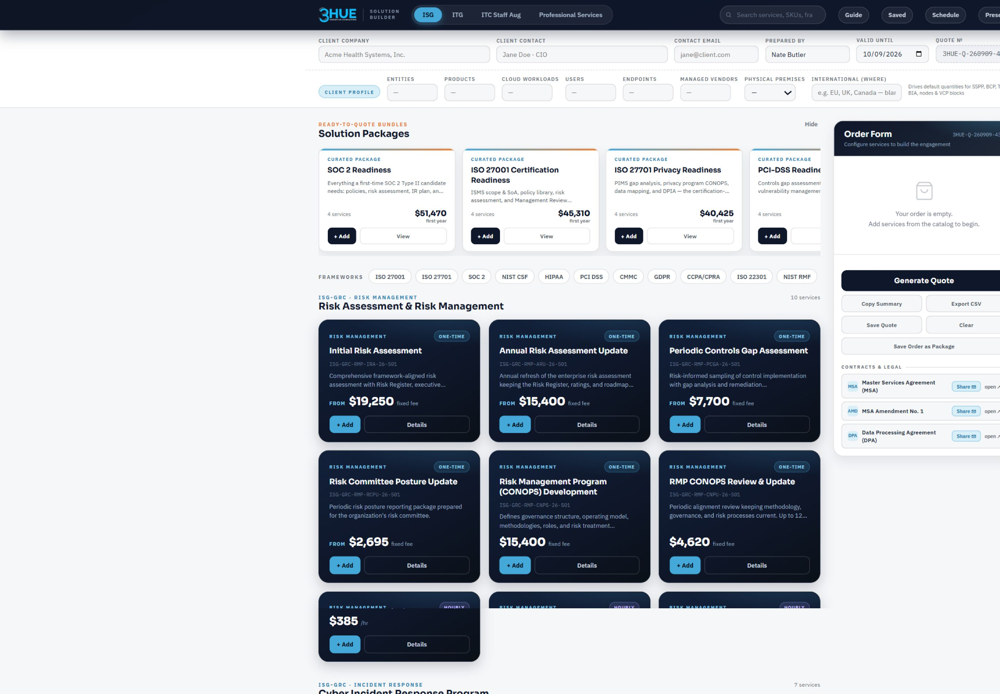
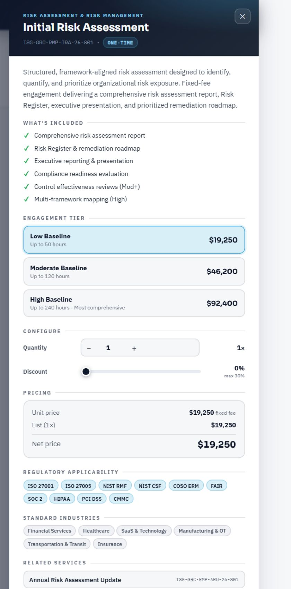
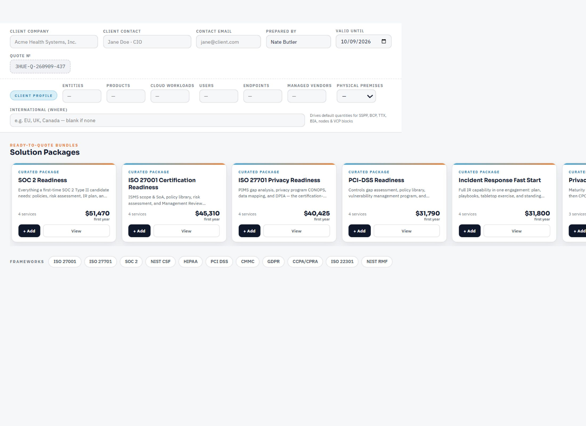

# Solution Builder visual references

Captured September 9, 2026 from [3HUE Solution Builder](https://builder.3hue.net/) during discovery for 3HUE Market Intel. These are screenshots of the existing tool, not mockups or implemented Market Intel screens.

## 01 — Workspace, navigation, cards, and side rail

Adopt the navy header, 3HUE branding, cyan active navigation, light workspace background, rounded cards, and clear primary/secondary button hierarchy. The side rail demonstrates a useful secondary workspace pattern. Its possible use for a marketing brief or selected intelligence remains a proposal.

## 02 — Detailed information drawer

Adopt the dark title area, white reading surface, uppercase section labels, dividers, and compact contextual tags. Opening detail alongside the main workspace is the reference interaction. For Market Intel, the content could explain a market event, affected buyers, relevant 3HUE services, and supporting evidence. Pricing tiers, quantities, and discount controls are quote-builder features, not requirements for Market Intel.

## 03 — Curated cards and filters

Adopt the compact card summaries, cyan-to-orange top accent, strong titles, and pill-shaped filters. Potential intelligence equivalents include curated market updates and a small set of relevant topic filters. Final categories depend on the supplied ICP and strategy.

## Capture limitations

The in-app browser produced scaling, clipping, and blank-region artifacts during capture. These three retained images were visually reviewed and contain useful reference elements; they are component references, not pixel-perfect full-page baselines. The workspace image clips part of the far-right edge. The third image contains blank regions and omits the header. Unusable blank captures were discarded. A reliable visual capture of the market-comparison section was not obtained; its observed content is described in the discovery notes instead.

No quotes, bookings, live AI checks, or external submissions were executed during this review. No website implementation was created.
